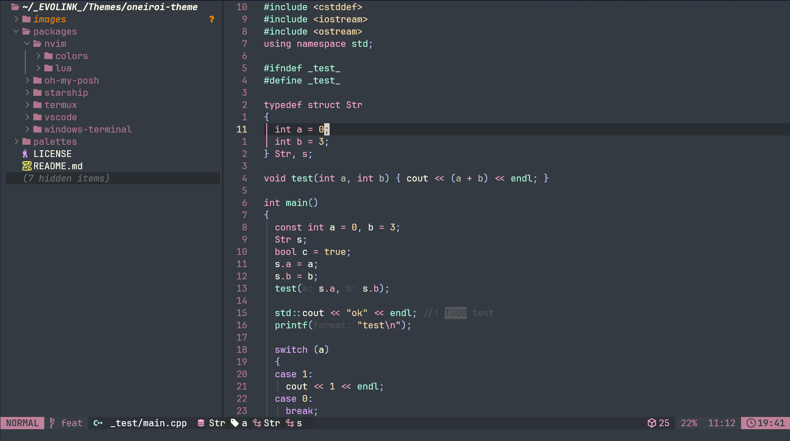
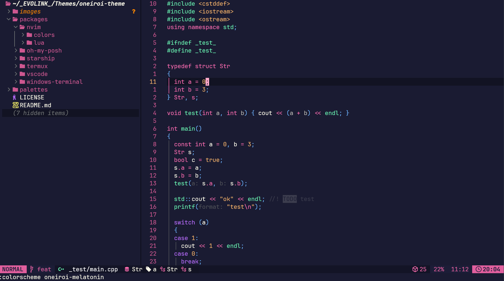

# Oneiroi theme for [Neovim](https://neovim.io/)

> A fantastic theme for `Neovim`.  

  

  
  
  

## Themes available

- oneiroi dream

  

- oneiroi melatonin

  

## Installation

Hello fantasy world!🎉
